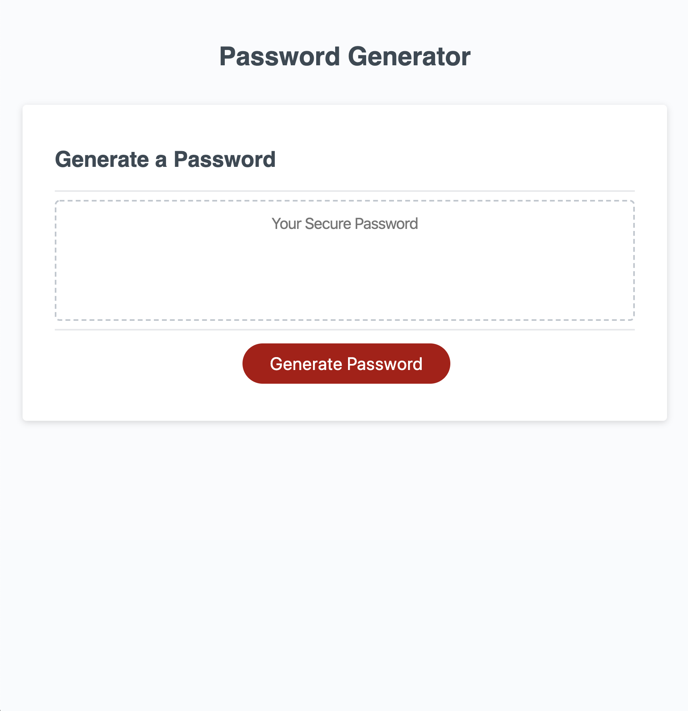
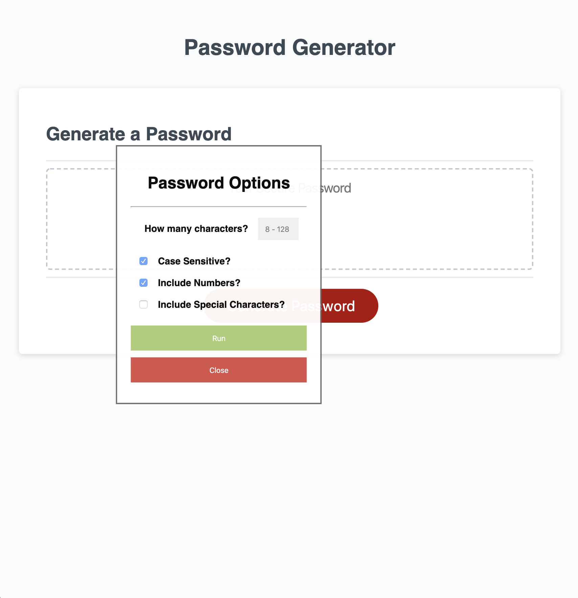

03 JavaScript: Password Generator

> I needed an app that could create robust passwords and adapt to
> unique specifications on a per case basis. This was the result.


## User Story

```
AS AN employee with access to sensitive data
I WANT to randomly generate a password that meets certain criteria
SO THAT I can create a strong password that provides greater security
```

## Design Focus

```
GIVEN I need a new, secure password
WHEN I click the button to generate a password
THEN I am presented with a series of options for password criteria
WHEN prompted for password criteria
THEN I select which criteria to include in the password
WHEN prompted for the length of the password
THEN I choose a length of at least 8 characters and no more than 128 characters
WHEN prompted for character types to include in the password
THEN I choose case-sensitive, numeric, and/or special characters
WHEN I initiate the algorithm
THEN my input should be validated and at least one character type should be selected
WHEN the algorithm runs
THEN a password is generated that matches the selected criteria
WHEN the process is finished
THEN the password is written to the page
```

## Deployed@
https://ionathas78.github.io/200319-passwordCreator/

## Screenshots



